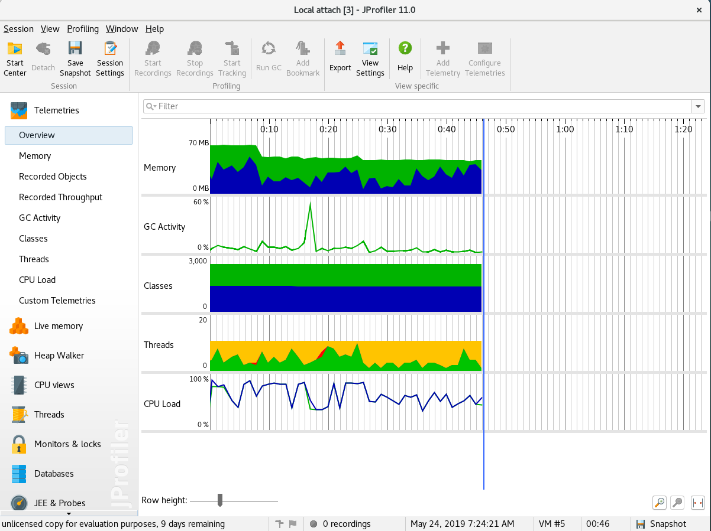
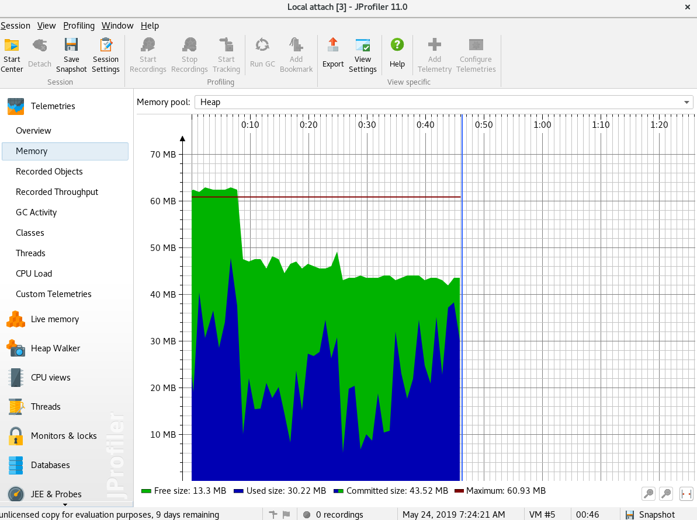

# Coding task

## Building

1. Create gradle wrapper by executing following command in command line:

```
gradle wrapper

```

2. Use gradle wrapper to build an app:

```
./gradlew build
```

3. Use gradle wrapper to produce fat-jar (by shadow plugin):

```
./gradlew shadow
```


### To run tests

```
./gradlew test
```

## Running app


Run already created fat-jar. Test data is located in `test/data/`

```
gzatorski@debian:~/Dokumenty/Github/luxoft-sensors$ java -jar build/libs/sensors-all.jar test/data/
Num of processed files: 12
Num of processed measurements: 12000
Num of failed measurements: 979

Sensors with highest avg humidity

sensor-id,min,avg,max
    
s6,0,47,101
s1,0,47,101
s4,0,46,101
s5,0,46,101
s2,0,46,101
s3,0,45,101
s12,0,45,101
s8,0,45,101
s9,0,45,101
s7,0,45,101
s10,0,45,101
s11,0,45,101

```

## Profiling


Memory test was performed on couple of files that exceed amount of app memory:

```
gzatorski@debian:~/Dokumenty/Github/luxoft-sensors/test/data$ du -hs *
65M	leader-13.csv
129M	leader-14.csv
...
```

App was run with `-Xmx64m`:

```
java -jar -Xmx64m build/libs/sensors-all.jar test/data/

```





